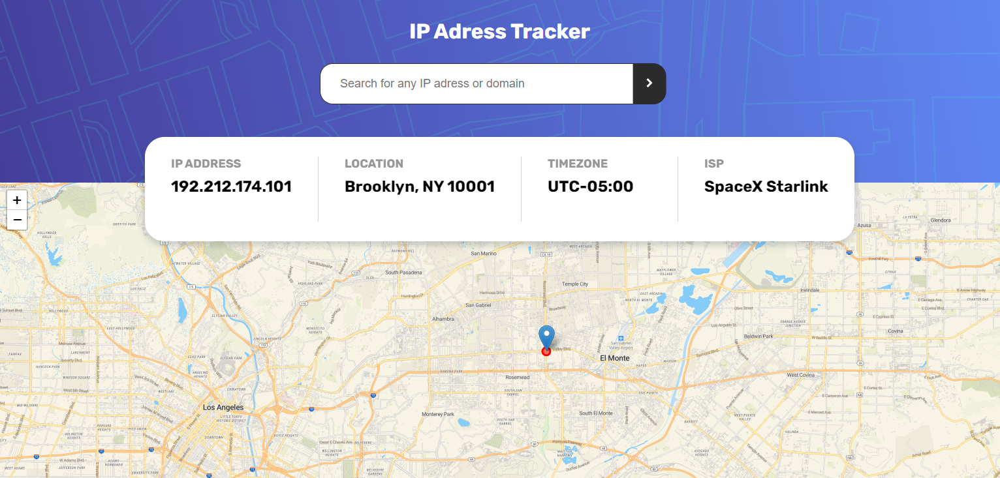

# Frontend Mentor - IP address tracker solution
> This is a solution to the IP address tracker [challenge](https://www.frontendmentor.io/challenges/ip-address-tracker-I8-0yYAH0). 

## Overview

### Screenshot

### Features

* Search for any IP addresses or domains and see the key information and location
* Also validation was implemented
* See the location on the cool interactive map
* Fully adaptive

### Links

- Solution URL: [here.](https://www.frontendmentor.io/solutions/iptracker-application-with-js-w4PDF30Ru)
- Live Site URL: [here.](https://ic3top.github.io/Frontend-Mentor/ip-address-tracker/dist/)

## My process

### Built with

- HTML5
- SCSS
- JS
- Webpack

### Useful resources

- [Leaflet used in my project](https://leafletjs.com/) - This is how I created a mobile-friendly interactive map. I really liked this library and can't wait to use it next time.
- [How to use Leaflet guide](https://www.youtube.com/watch?v=wVnimcQsuwk)
- [Api for detecting geolocation by IP](https://geo.ipify.org/)
